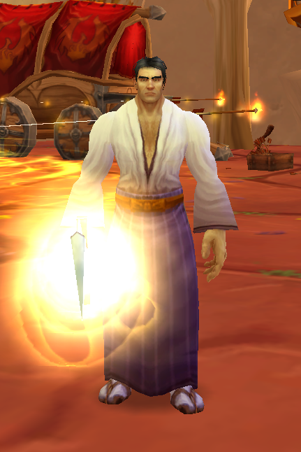
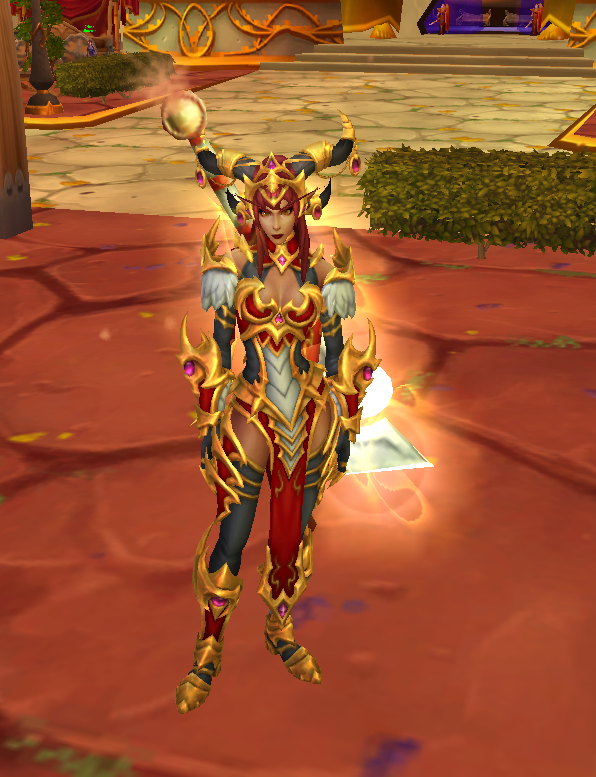
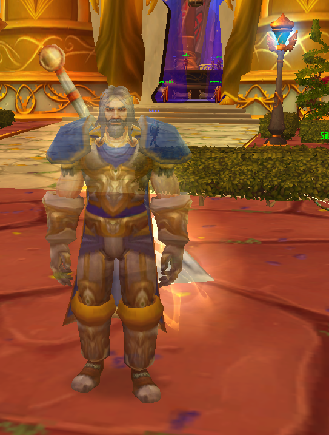
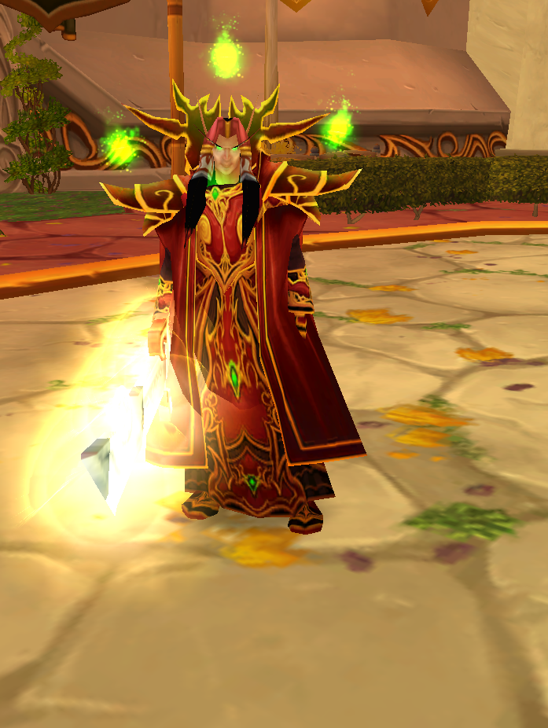
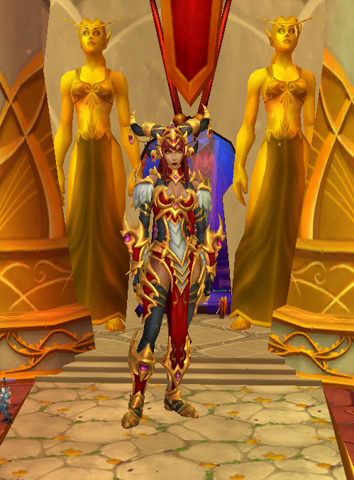

# Transmorpher

Transmorpher is a **client-side transmogrification system** for **World of Warcraft: Wrath of the Lich King (3.3.5a)** based on morphing.

The addon allows players to locally modify their visual appearance without affecting gameplay or server-side data. Visual changes are client-side by default, with an optional multiplayer synchronization mode that shares morph state with other users running Transmorpher.

Transmorpher provides a powerful interface for customizing character appearance, equipment visuals, mounts, pets, and other cosmetic elements.


---

## Features

### Equipment & Appearance
- **Equipment morphing** — change the visual of any equipped armor or weapon slot
- **Equipment visibility** — hide individual equipment slots (helm, cloak, etc.)
- **Weapon enchant morphing** — apply any enchant glow visual to main-hand or off-hand
- **Character model morphing** — change your character's race/creature appearance
- **Character scaling** — resize your character model

### Mounts, Pets & Companions
- **Mount morphing** — change your mount's appearance to any mount model
- **Per-mount morphing** — assign different morph targets to individual mounts
- **Companion pet morphing** — change your companion pet's appearance
- **Hunter combat pet morphing** — change your hunter pet's model with scaling support

### Systems
- **Loadout system** — save and apply complete appearance presets (gear, morph, mount, pet, enchants, scale)
- **Complete 3.3.5 class set database** — 441 tier/class sets for quick browsing and application
- **Dressing Room UI enhancements** — in-addon preview with live item try-on
- **Character title morphing** — display any title
- **Time of day control** — set client-side day/night environment
- **Persistent morphs** — all changes survive logout and reload
- **Optional multiplayer synchronization** — world-wide sync so other Transmorpher users see your morphs

---

## Requirements

- World of Warcraft **Wrath of the Lich King 3.3.5a** (build 12340)
- The **StealthMorpher DLL** (`dinput8.dll`) placed alongside your `Wow.exe`

> **Note:** Transmorpher is designed for and tested on **Warmane** WotLK servers. It may work on other 3.3.5a servers but compatibility is not guaranteed.

---

## Installation

1. Download the latest release from [GitHub Releases](https://github.com/Kirazul/Transmorpher/releases).

2. Extract the `Transmorpher` folder into your WoW `Interface/AddOns/` directory:
   ```
   World of Warcraft/
   ├── Interface/
   │   └── AddOns/
   │       └── Transmorpher/    ← addon folder goes here
   ├── Wow.exe
   └── dinput8.dll              ← DLL goes here
   ```

3. Place `dinput8.dll` next to your `Wow.exe`.
   - **Alternative proxy names:** You can rename it to `version.dll` or `dsound.dll` for compatibility with other DLL proxies.

4. Launch the game and enable **Transmorpher** from the AddOns menu on the character select screen.

---

## Usage

### Opening the Addon
- Type `/morph` or `/vm` in chat to toggle the Transmorpher window
- Click the Transmorpher minimap button

### Slash Commands

| Command | Description |
|---|---|
| `/morph` | Toggle the Transmorpher window |
| `/morph reset` | Reset all morphs to default |
| `/morph status` | Show DLL and morph status |
| `/morph morph <displayID>` | Morph character to a creature display ID |
| `/morph scale <0.1-10>` | Set character model scale |
| `/morph mount <displayID>` | Morph mount to a display ID |
| `/morph pet <displayID>` | Morph companion pet to a display ID |
| `/morph hpet <displayID>` | Morph combat pet to a display ID |
| `/morph enchant <mh\|oh> <id>` | Apply enchant visual to main-hand or off-hand |
| `/morph title <titleID>` | Apply a character title |
| `/morph sync` | Force broadcast state to synced peers |
| `/morph help` | Show command help in-game |

---

## Multiplayer Sync

Transmorpher includes an optional **peer-to-peer sync** system so other players running the addon can see your morphed appearance.

### How It Works
1. When you enter a zone, a silent discovery message is sent to nearby Transmorpher users
2. Players exchange morph states via addon messages (completely invisible in chat)
3. Full mutual sync completes in ~2-3 seconds — no group or party is required
4. All sync messages are filtered from all chat channels — completely invisible

### Enabling / Disabling
- Open the **Settings** tab in the Transmorpher window
- Toggle **World Sync** on or off
- When disabled, all remote player morphs are instantly reverted

---

## Troubleshooting

| Problem | Solution |
|---|---|
| **"DLL Not Loaded" in status bar** | Ensure `dinput8.dll` is placed next to `Wow.exe`, not inside the AddOns folder. Try renaming it to `version.dll` or `dsound.dll` if another addon uses `dinput8.dll`. |
| **Antivirus blocks/removes the DLL** | Add an exception for the DLL file in your antivirus software. The DLL is a proxy that hooks into the game client for visual-only modifications. |
| **Morphs reset after teleporting** | This is expected — morphs are automatically re-applied after zone transitions. If they don't re-apply, type `/morph status` to verify the DLL is loaded. |
| **Other players can't see my morph** | Ensure **World Sync** is enabled in Settings. The other player must also be running Transmorpher. |
| **Shapeshift/form breaks my morph** | In Settings, enable **Keep morph in shapeshift** to prevent morph suspension during Druid forms, Ghost Wolf, etc. Alternatively, use the **Forms** tab to assign specific morphs per form. |

---

## Version

Current release: **1.1.9**

---

## Changelog

### 1.1.9
- Version bump and internal improvements
- Improved state persistence reliability
- **NEW:** Improved logging system. The log is now automatically saved to `Logs/Transmorpher.log` and clears itself on each game launch to prevent file size bloat.

### 1.1.8
- **NEW:** Implemented 255-byte message limit bypass for full gear sync (dual Thunderfury + full sets now work)
- **NEW:** Multipart message system splits large states into chunks and reassembles transparently
- Removed group/raid-only sync mode (world sync only)
- Added comprehensive chat filters to prevent ALL sync message leakage (party, raid, guild, whisper, system)
- Added instant remote player revert when disabling world sync (your morph stays)
- Improved AFK/DND message filtering
- Enhanced system message filtering for failed whispers
- Fixed teleport bug: morphs now properly reset after teleporting
- Fixed world sync disable: other players now properly revert to original appearance

### 1.1.5
- Added multiplayer synchronization controls in Settings with world/group modes
- Improved mount morph backend stability and invalid mount-state recovery
- Improved enchant preview behavior, including off-hand fallback handling

### 1.1.3
- **CRITICAL:** Fixed a crash caused by the Time Morph hook overwriting adjacent memory
- **FIX:** Fixed morph reversion bug where players would revert to native race instead of morphed race after shapeshift/proc (DBW) expiry
- **NEW:** Added **Universal Proxy** support: DLL can now be renamed to `version.dll` or `dsound.dll` for compatibility

### 1.1.2
- Fixed Title Morph name hiding bug
- Fixed Sets Tab persistence issues
- Fixed Misc Tab UI layout bugs

### 1.1.1
- Fixed all Hunter combat pet IDs
- Fixed morph size not resetting when switching to another morph
- Fixed Interact with Mouseover / Interact with Target keybind issues while the addon is enabled
- Fixed Hide Equipment persistence when applying a new item
- Added a new Sets system containing all 3.3.5 class sets (441 sets)
- Added morph scale and pet scale to loadout saves
- Added time control for day/night cycle
- Added title morphing

---

## Screenshots

### Morph System


### Mounts


### Pets


### Loadouts


### Settings


---

## How It Works

Transmorpher operates entirely on the client side using two components:

1. **Lua Addon** — manages UI, state persistence, event handling, and P2P sync
2. **DLL Proxy** (`dinput8.dll`) — hooks into the game client to modify visual display fields in memory

The addon communicates with the DLL through a global Lua variable that the DLL polls every ~20ms. All changes are purely visual and affect only your local client (unless multiplayer sync is enabled, in which case other addon users see your morphed appearance via addon messages).

**No server-side data is modified.** Other players without the addon will always see your normal, unmodified character.

---

## Disclaimer

Transmorpher modifies client-side visual data only. It does not interact with or modify any server-side data. Use at your own discretion. The authors are not responsible for any consequences resulting from the use of this software.

---

## Compatibility

- World of Warcraft **Wrath of the Lich King 3.3.5a** (build 12340)
- Designed for **Warmane** WotLK servers
- Client-side functionality with optional addon-to-addon multiplayer sync
- Does not modify server data
