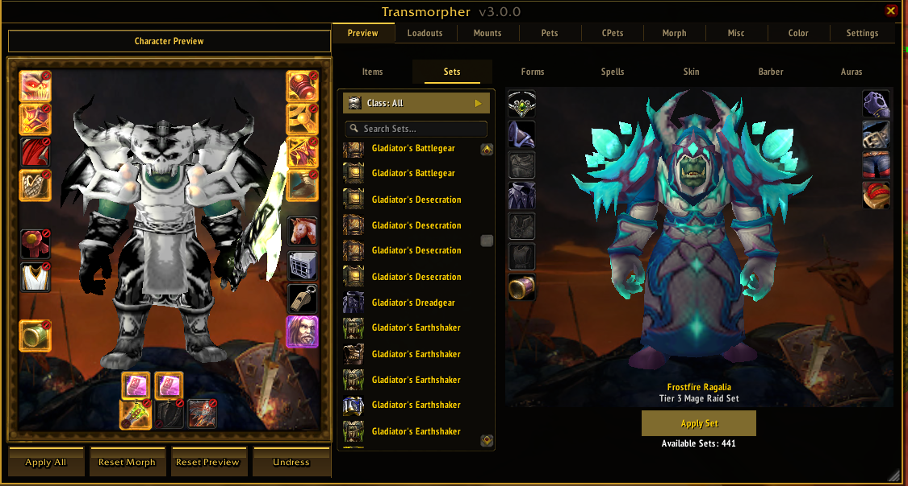

# Transmorpher

Transmorpher is a full client-side appearance and morphing suite for World of Warcraft: Wrath of the Lich King 3.3.5a.

It goes far beyond a basic transmog browser. The addon can preview and morph gear, race, creature displays, mounts, companion pets, hunter pets, enchants, titles, spell visuals, shapeshift forms, barber appearances, item textures, persistent aura visuals, damage text colors, creature/mount recoloring, and selected world presentation settings from one UI, with optional peer-to-peer sync for other addon users.

## Highlights

- Full equipment transmogrification workflow with slot-based preview and direct apply.
- Creature and race morphing with saved favorites, recent morphs, and direct display ID search.
- Mount, companion pet, and hunter pet morphing, including quick reset access.
- Enchant visual morphing for main-hand and off-hand weapons.
- Account-wide loadouts with talent spec bindings, auto-apply support, and TM1 import/export.
- Form morph assignments for druid, shaman, warlock, priest, and DBW-style transformations (13 groups).
- Direct spell morphing from your spellbook to other spell visuals.
- Conditional aura-triggered spell visual swapping with custom rules.
- Persistent aura visual browser to permanently wear spell visual effects.
- Full barbershop controls with DBC-driven options and per-region free-RGB tint, gradient, rainbow, and two-tone recolor.
- Per-slot item recolor system with tint modes, color direction, contrast, brightness, saturation, hue, and glow control.
- Creature and mount recoloring via BLP texture path resolution with persistent account-wide storage.
- Texture capture mode for discovering recolorable textures in-game.
- Damage text color customization with 8 categories including rainbow mode and global size slider.
- Animated glow system with 6 colors, gradient mode, and multi-layer breathing animation.
- Search-heavy UI with debounced input across items, sets, creatures, pets, titles, spells, and optimization lists.
- Optional P2P world sync that shares visuals with other Transmorpher users without chat spam.
- Client-side controls for time of day, fog, far clip, smooth textures, 21 render analysis toggles, distance culling, spell optimization, and HD font mode.
- Dressing room with live character mirroring, faked client-side preview, race-specific backgrounds, and drag rotation.

## What Transmorpher Covers

| Area | What you can do |
| --- | --- |
| Gear | Preview items by slot and armor/weapon subclass, apply hidden-slot looks, browse enchants, inspect item IDs, open Wowhead links, cycle through donor items sharing the same appearance (Tab key), view per-item source records, recolor item textures per slot with tint/glow/color controls. |
| Sets | Browse item sets by class with class icon filter, preview full outfits on the dressing room model with race-specific background, inspect individual slot pieces. |
| Character Morphs | Switch to any race model (male/female), apply creature display IDs, resize your character (0.1x-10.0x), save favorite morphs with rename/reorder, undo support (40-deep stack), 12-entry recent morphs list. |
| Mounts | Search by name, type, or display ID, filter by All/Ground/Flying, apply universal/ground/flying mount morph, hide the mount model, reset it. Per-mount recolor button for creature skin tinting. |
| Pets | Search and morph companion pets with quick apply and reset support. |
| Combat Pets | Morph hunter pets from a curated family list with type/family filter, or browse all ~15k creature displays. Direct display ID entry, dedicated scale input (0.1-10.0) with resize button. Includes warlock demons and water elemental. |
| Enchants | Browse and apply main-hand and off-hand enchant visuals from the preview workflow. |
| Titles | Search and apply character titles from a dedicated searchable picker. |
| Forms | Assign creature display IDs to 13 form groups: Bear, Cat, Moonkin, Tree, Travel, Aquatic, Flight, Ghost Wolf, Metamorphosis, Shadowform, DBW_1 through DBW_4. Auto-detects available forms from shapeshift bar with class fallback. |
| Spell Visuals | Remap any spellbook spell to another spell visual, persisted per character. |
| Aura Spell Swaps | Create conditional rules that auto-swap spell visuals when specific auras are active. |
| Persistent Aura Visuals | Browse and wear spell visual effects permanently, surviving morphs, forms, zoning, and relogs. Search by name or numeric ID. Global persist, auto-heal, and mute toggles. |
| Barber Controls | Adjust skin tone, face, hair style, hair color, facial hair. DBC-driven option counts. Per-region free-RGB tint with Solid, Gradient, Rainbow, and Two-Tone modes, glow toggle, and full saturation/brightness/contrast/hue sliders. |
| Item Recoloring | Re-skin transmogged items per slot with another item's texture. Tint modes: Solid, Gradient, Rainbow, Two-Tone. Controls: intensity, glow, contrast, rainbow spread, color shift, brightness, saturation, hue. Direction: Vertical, Horizontal, Diagonal. |
| Creature & Mount Recoloring | Browse ~15k creature displays with NPC/Boss/Normal classification filters. Recolor any creature or mount via BLP texture path resolution. Persistent account-wide storage with zone-change re-application. Texture capture mode for discovering recolorable textures. |
| World Presentation | Set client-side time of day (0-24h with Set Time/Reset), fog (enable, color picker, start/end sliders), far clip distance (enable, slider 100-2666), and smooth textures with adjustable bias. |
| Render Analysis | Toggle 21 render and analysis flags across 4 categories: Scene Visibility, Environment Flags, Debug Visualization, and Smooth Textures. |
| Distance Culling | Master distance slider (0-200 yd) with per-category hiding: other players, their pets/summons, all NPCs/creatures, ground effects, corpses. Instant cleanup: shadows, summons, nameplates, chat bubbles, player sounds. Group/raid member protection. |
| Damage Text Colors | Customize 8 text categories: Damage, Damage Crit, Healing, Healing Crit, Miss/Dodge/Parry, Absorb, XP, Honor. Per-category rainbow mode with speed slider. Global size slider (0.7-2.5x). Auto-enables combat text CVars. |
| Optimization | Smart visual filtering with 15 spell part categories, per-target-group control (self/pet/raid/other players/NPCs/bosses), per-class filters, recommended raid preset. Protected spell list with tier-based raid spell protection (T7-T10, VOA). Unit/name pattern suppression. |
| Sync | P2P world sync via RAID/PARTY + GUILD + WHISPER channels with automatic peer discovery, state broadcasting, chat filtering, vehicle forwarding, and suppression mode. |
| HD Font | Queue MSDF font rendering for the next client launch with 3 modes: Enhanced + FXAA, Classic, Disabled. |

## Tab Guide

### Main Tabs

| Tab | Purpose |
| --- | --- |
| `Preview` | Main browsing and preview hub with 7 sub-tabs: items, sets, forms, spells, skin recolor, barbershop, and persistent aura visuals. |
| `Loadouts` | Save, preview, duplicate, overwrite, delete, and apply full appearance presets with talent spec binding, auto-apply, description fields, and TM1 export/import. |
| `Mounts` | Searchable mount morph browser with All/Ground/Flying type filter, per-mount recolor button, set, hide, and reset actions. |
| `Pets` | Searchable companion pet morph browser with quick apply and reset. |
| `CPets` | Hunter pet and creature-display browser with dual Curated/All Creatures mode, type/family filter, direct display ID input, dedicated scale slider with resize, and status display. |
| `Morph` | Race morph buttons with male/female toggle, creature display ID search with priority scoring, scale slider, random morph, morph-to-target, 12-entry recent morphs, favorites management with add/rename/reorder/remove. |
| `Color` | Creature and mount recoloring browser, saved recolors management, damage text color customization with 8 categories, rainbow mode, and global size slider. |
| `Misc` | Time control, atmosphere (fog + far clip), distance culling with master slider, 21 render analysis toggles, titles, HD font modes, and spell optimization. |
| `Settings` | Persistence toggles, behavior options, sync activation, interface buttons, DLL status, and about section. |

### Preview Sub-Tabs

| Sub-Tab | Purpose |
| --- | --- |
| `Items` | Browse item appearances by slot and armor/weapon subclass, search by item name or ID, try-on preview on dressing room model, Tab-key cycling through donor items, Shift+click for item link, Ctrl+click for Wowhead URL. |
| `Sets` | Browse class-filtered item sets with class icon dropdown, preview full outfits on dressing room model with race-specific background, inspect individual slot pieces. |
| `Forms` | Card-based layout with creature selector dialog, priority-based search scoring, per-card glow when assigned, Select/Change and Reset buttons. Auto-detects available forms. |
| `Spells` | Source and target spell selection from spellbook, optional "show all ranks" toggle, Morph and Reset buttons. |
| `Skin` | Per-slot item recolor via donor item lookup with tint modes (Solid/Gradient/Rainbow/Two-Tone), full color controls, glow toggle, and direction buttons. |
| `Barber` | 5 category cards (Skin Tone, Face, Hair Style, Hair Color, Facial Hair) with DBC-driven discrete sliders. Custom Color sub-panels for Skin Tone and Hair Color with full tint controls. |
| `Auras` | Persistent aura visual browser from RE enumeration with lazy loading, search by name or numeric ID, worn visuals management, global persist/auto-heal/mute toggles, and Clear All button. |

### Misc Sub-Panels

| Sub-Panel | Purpose |
| --- | --- |
| `Time Control` | Override client-side time of day (0.0-24.0 range, 0.5 step) with Set Time and Reset buttons. Shows HH:MM format. |
| `Environment` | Fog override (enable toggle, hex color picker, start/end sliders 0-4000/0-6000) and far clip override (enable toggle, slider 100-2666) with Reset buttons. |
| `Analysis` | 21 render analysis checkboxes across 4 cards: Render Overrides (smooth textures + bias slider), Scene Visibility (M2, terrain, WMO, shadows, occluders, fade), Environment Flags (clutter, collision, liquid, mountains, specular, shadows), Debug Visualization (wireframe, normals). |
| `Distance Culling` | Master enable + distance slider (0-200 yd). Per-category: other players, their pets/summons, all NPCs/creatures, ground effects, corpses. Instant toggles: shadows, summons, nameplates, chat bubbles, player sounds. Group/raid protection checkbox. Reset button. |
| `Titles` | Searchable title list with Equip and Remove buttons. |
| `HD Font` | 3 radio modes: Enhanced + FXAA, Classic, Disabled. Queued for next client launch. |
| `Optimization` | Two sub-tabs: Smart Filter (enable, 15 visual part checkboxes, target group checkboxes, class filters, recommended preset) and Protected List (search, paginated list, add/remove/export). |

### Other Tabs (Accessed via workflows)

| Tab | Access |
| --- | --- |
| `Barber` | Accessed through the dressing room or gear workflow. Full barbershop controls with DBC-driven options and per-region free-RGB tinting. |
| `Skin` | Accessed per equipment slot. Per-slot item recolor system with tint modes, color direction, contrast/brightness/saturation/hue, and glow. |
| `Visuals` | Accessed through spell/aura workflows. Persistent aura visual browser, worn set management, and global persist/auto-heal/mute controls. |
| `Aura Swap` | Accessed through spell workflows. Conditional aura-triggered spell visual swap rule editor. |

## Loadouts

Loadouts are one of the biggest features in the addon. A loadout captures:

- Equipment appearance and hidden-slot state (per-slot eye toggle).
- Per-weapon-slot sheathe positions (Back/Hip/Hidden/Default).
- Main-hand and off-hand enchant visuals.
- Mount morph and mount hidden state.
- Companion pet morph.
- Combat pet morph and scale.
- Character morph (race/creature) and scale (0.1x-10.0x).
- Active title.
- Loadout name and description field.

You can also:

- Preview a saved loadout before applying it.
- Duplicate an existing loadout to create a variant.
- Overwrite an existing loadout with current state.
- Delete old loadouts.
- Bind a loadout to Primary or Secondary talent spec.
- Auto-apply bound loadouts when you switch specs.
- Export loadouts as portable TM1 strings (`TM1|1|name|items|hidden|emh|eoh|mount|mhidden|pet|hpet|hpscale100|morph|mscale100|title|mounts`).
- Import TM1 strings from other users or backups.

## Dressing Room

The dressing room provides a live preview environment:

- Real-time character mirroring that follows your actual character.
- Faked client-side preview via DLL sentinels (PV_TRYON_BASE, PV_TRYON_SLOT_BASE) for item try-on without affecting your real gear.
- Per-race/sex X/Z position clamping for stable model placement.
- Left-click drag rotation, right-click vertical drag, Alt + right-click zoom, mouse wheel zoom.
- Race-specific background images for all 10 races.
- Debug info overlay showing facing, X, and Z position.

## Glow System

Items and active elements use a multi-layer animated glow system:

- 3 animation layers: inner shimmer, main border breathing, outer halo pulse.
- 6 color types: gold, purple, blue, pink, green, red.
- Gradient glow mode with left/right color split on each layer.
- Confirmation flash animation (white burst, hold 1s, fade to target color).
- 30 FPS animation loop with different frequencies per layer for an "alive" feel.
- 0.3s fade-in on activation.

## Controls And Shortcuts

| Action | Result |
| --- | --- |
| Left-click an equipment slot | Select the slot and jump to matching item previews. |
| Alt + Left-click an item slot | Apply the currently previewed item morph to that slot. |
| Right-click an equipment slot | Remove or reset the slot morph. |
| Shift + Left-click an item slot | Print the item link and item ID to chat. |
| Ctrl + Left-click an item slot | Open a Wowhead URL dialog for the item (retail/classic toggle). |
| Tab key on item preview | Cycle through donor items sharing the same appearance. |
| Left-click an enchant slot | Enter enchant browsing mode in Preview. |
| Alt + Left-click an enchant slot | Apply the selected enchant visual. |
| Right-click an enchant slot | Remove the enchant morph. |
| Left-click an eye icon on a slot | Toggle slot item visibility (hide/show). |
| Left-click a sheathe icon on a weapon slot | Set sheathe position (Back/Hip/Hidden/Default). |
| Left-click a special slot under the model | Open the related tab. |
| Right-click a special slot | Clear the current mount, pet, combat pet, or character morph. |
| Left-click minimap button | Toggle the main window. |
| Right-drag character info button | Reposition the character-frame launcher vertically. |

## Slash Commands

| Command | Description |
| --- | --- |
| `/morph` | Toggle the Transmorpher window. |
| `/morph reset` | Reset all active morphs. |
| `/morph status` | Show DLL and current morph status. |
| `/morph morph <displayID>` | Morph your character to a creature or race display ID. |
| `/morph scale <value>` | Set character scale. Use `0` for default. |
| `/morph mount <displayID>` | Morph your mount. |
| `/morph pet <displayID>` | Morph your companion pet. |
| `/morph hpet <displayID>` | Morph your hunter pet. |
| `/morph enchant <mh\|oh> <enchantID>` | Apply an enchant visual. |
| `/morph title <titleID>` | Apply a title. |
| `/morph sync` | Broadcast your current state to peers. |
| `/morph export` | Export a TM1 loadout string of your current state. |
| `/morph import <string>` | Import and apply a TM1 loadout string. |
| `/morph random` | Random creature morph. |
| `/morph target` | Morph into your target's appearance. |
| `/morph undo` | Undo the last character morph (40-deep history). |
| `/morph helm` | Toggle helm visibility. |
| `/morph cloak` | Toggle cloak visibility. |
| `/morph ss` | Take a screenshot. |
| `/morph fov <20-350>` | Set the camera field of view (0 = client default). |
| `/morph help` | Show command help. |

Aliases: `/vm` and `/Transmorpher`

## Multiplayer Sync

World sync is optional and can be toggled in `Settings`.

When enabled, Transmorpher shares your appearance state with other addon users nearby or connected through supported addon-message routes. The sync system operates across RAID/PARTY, GUILD, and WHISPER channels:

- Automatic peer discovery with heartbeat and mutual handshake.
- State re-broadcasts after any appearance change.
- Chat filtering hides sync traffic from visible chat windows.
- Large state payloads are handled safely with chunked transfer.
- Vehicle state forwarding for mounted appearance continuity.
- Suppression mode to control what gets shared.
- Self visibility option to see your own morphs in the sync view.
- Peer name configuration and notification suppression.

This means sync is useful for shared social visuals, RP, events, or coordinated client-side appearance setups without polluting normal chat windows.

## Settings And Persistence

The addon supports both account-wide and per-character persistence.

### Account-level data

- Morph favorites (with rename and reorder).
- Global settings.
- Saved loadouts (with descriptions and TM1 format).
- Damage text color configurations.
- Window position and size.
- Creature and mount recolors (ColorAssets with BLP texture paths).

### Character-level data

- Current active morph state (items, hidden slots, morph, scale).
- Per-character settings.
- Mount, pet, and combat pet state.
- Form and spell morph assignments.
- Aura swap rules.
- Persistent aura visual set.
- Barber shop state (skin, face, hair, hair color, facial hair).
- Item recolor state per slot.
- Sheathe positions (per weapon slot: Back/Hip/Hidden/Default).
- Hidden slot states.

### Settings UI cards

| Card | Controls |
| --- | --- |
| `Persistence` | Persist morph across sessions, Save mount morph per character, Save pet morph per character, Save combat pet morph per character. |
| `Behavior` | Show Warlock Metamorphosis, Keep morph in shapeshift forms. |
| `Multiplayer Sync` | Activate World Sync. |
| `Interface` | Show Minimap Button, Hide Character Info Button. |
| `System Status` | DLL loaded/not loaded status indicator. |
| `About` | Version, description, and requirements. |

## Installation

1. Copy the `Transmorpher` addon folder into your WoW addons directory:

   `World of Warcraft/Interface/AddOns/Transmorpher`

2. Place `dinput8.dll` in your WoW root directory, next to `Wow.exe`.

3. If you use Universal Proxy instead of the bundled DLL loader, configure that instead.

4. Launch the client and use `/morph` to open the UI or click the minimap button.

## Changelog

### 3.0.0

#### Skin Tab
- Recolor any equipment piece with a full color customization suite: color picker, tint intensity, contrast, brightness, saturation, hue shift, and glow toggle.
- Tint modes: Solid, Gradient, Rainbow, Two-Tone.
- Change the texture of any equipment slot to any other item in the game.
- Texture capture mode for discovering recolorable surfaces in-game.
- Persistent account-wide storage for all recolor data.

#### Barber Tab
- Customize skin tone, face, hair style, hair color, and facial hair with DBC-driven option counts.
- Per-region free-RGB tinting with Solid, Gradient, Rainbow, and Two-Tone modes.
- Full saturation, brightness, contrast, and hue sliders per region.
- Tint applies in real time and persists across sessions.

#### Persistent Auras
- Browse all spell visuals in-game and attach them to your character permanently.
- Seamless loop animation with no respawn, no pulse, no flicker.
- Stack multiple auras simultaneously (e.g. Devotion Aura on loop while stacking other effects).
- Auras survive morphs, forms, zoning, and relogs when Persist is enabled.
- Auto-heal mode and mute toggle included.

#### Weapon Position Control
- Change main-hand and off-hand weapon sheathe position between Back and Hips.
- Hide main-hand and/or off-hand weapons entirely.
- Applies in real time to the character model.

#### Morph Tab Quick Actions
- Random Morph button: instantly apply a random creature display.
- Copy Target button: morph to your current target's creature display (NPC targets only).

#### Weather and Sky Control
- Control weather state: Clear, Rain, Snow, Sandstorm.
- Adjust weather intensity with a slider.
- Skybox Library: browse and apply any skybox in the WoW 3.3.5a database.
- Client-side only.

#### FOV Unlock
- Camera field of view unlockable up to 350 degrees.
- Slider control with instant reset to default.

#### Units
- Hide other players with distance slider.
- Hide pets, summons, and NPCs.
- Hide corpses.
- Toggle ground effects, shadows, nameplates, and chat bubbles.
- Mute player sounds.

#### Optimize Tab (Beta)
- Hide spell visuals based on your class and role.
- Filter by boss, NPC, and elite classification.
- 15 individual visual part categories with granular toggle control.
- Raid tier protection for T7, T8, T9, T10, and VOA.
- Protected spell list with search, add, remove, reload, and export.
- Recommended Raid FPS Preset for one-click optimization.

#### Color Tab
- Full damage text color customization across 8 categories: Damage, Damage Crit, Healing, Healing Crit, Miss/Dodge/Parry, Absorb, XP, and Honor.
- Per-category rainbow mode with independent toggle.
- Global damage text size slider.

#### Character Selection Persistence
- Race, equipment, and color customization now visible on the character selection screen.

#### Fixes
- Fixed double refresh on teleport and login.
- Fixed crash error when exiting the game.
- Fixed fog and far clip overrides not properly disabling.
- Fixed camera FOV not instantly resetting to default.

#### Optimization
- Reduced CPU usage across all subsystems.
- Improved loadout apply speed.

## Summary

Transmorpher is not just a transmog browser. It is a unified visual control panel for WotLK 3.3.5a that combines appearance morphing, spell visuals, form overrides, barber controls, item recolor, creature/mount recoloring, texture capture, aura swaps, persistent visuals, damage text colors, loadouts, sync, distance culling, spell optimization, render analysis, and world-side client customization into a single addon workflow.
